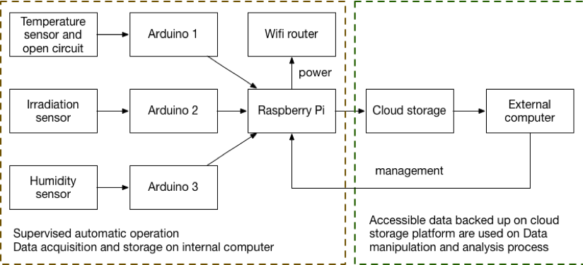

# Data Analysis 

A collection of Python Script used when clean and analyse the data.
The file path, file id, file code and file name of this project are encrypted in credentials files, therefore in order to utilize the code, please change the path, file name, file id, etc. accordingly


## Download Data

-  drive_download.py stackoverflow, added by Andrew Hundt
-  LoadData class retrieved measurement data from Google Drive
-  file_name_dict: dictionary of files name with unique key
-  file_id_dict: dictionary of Google Drive file's unique ID 
-  file (int): key in the file_name_dict
-  file_id (int): key in the file_id_dict
-  path_name: path to save the file retrieved from Google Drive, default = pre-defined path

## Clean Data

-  Contains 3 classes and a main function which read, normalized and merge all the data into on data table
-  Class ReadData: This class is used to read the individual data file retrieved from Google Drive 
including read_voltage, read_humidity and read_irradiance
-  the main_merge() function return a data table with timestamp as the index

### Class ReadData
-  file (int): key in the file_name_dict
-  path_name: path to save the file retrieved from Google Drive, default = pre-defined path_old
-  methods read_voltage(), read_humidity and read_irradiance() read the voltage data file, humidity data file and irradiance data file, respectively.
-  e.g read the voltage measurement file:
```
   import CleanData
   CleanData.ReadData(file = 1).read_voltage()
```

### Class CleanData 
-  dataframe: defined by reading the file by methods in ReadData class
-  sorted_path:  location of folder to save the normalized data file
-  _get_folder()_ get the folder to save the normalized data
-  _normalization()_ normalized the daily measurement in 1 minute interval
-  _iteration()_ run the normalization process for every day in the month
-  _month_data()_ run normalization() and iteration() for every month

### Class ReadNormalized 
-  file (int): key in the file_name_dict
-  path_name: path to normalized data files, default = pre-defined sorted_path
-  _read_month()_ read the data file of a month
-  _merger()_ merger all the monthly data files that have been read
-  main function _main_merge()_ return a data table with all normalized variables


### Class Regression

-  Create regression model with the formula: 
```
   voltage ~ irradiance + humidity + temperature 
```
-  Print the regression result and the variance inflation factor to .txt file
-  module: name tag of testing PV module

## PlotData

-  class PlotData is used to create 3 types of plot scatter plot, correlation plot and violin plot
-  _data_frame()_ creates unique data frame for each type of plots
-  :param types: 1: correlation plot, 2: scatter plot, 3: violin plot
#### scatter_plot() 
- plots voltage versus one of the environmental factor irradiance or temperature
- _:param types = 2_
- :param index: int
- :param var: 'T', 'irr' choose input data file
- in T scatter plot index in range(0,6); in irr scatter plot index in range(0,12)
       
#### correlation()
- visualizes the environmental factors' correlation coefficient on irradiance index or temperature index
- _:param types = 2_ (default)
- :param var: 'tc', 'humc', 'ic' are temperature, humidity and irradiance correlation coefficient, respectively

#### violin_plot()
- demonstrates the distribution of yielded voltage
- :param types = 3


### Note

To run this code:
- Python 3 or higher installed
- pandas, numpy, matplotlib and seaborn
- the _credential_ module is user-defined module containing file path and and encrypted information. 


