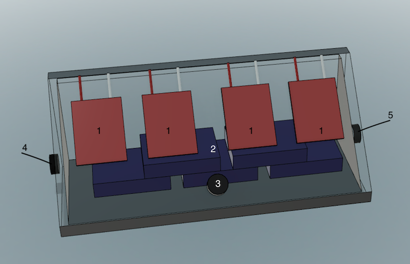

# LIWEfacades project - Open Testing Environment (O.T.E)
A Python script to created throughout the project that retrieved data from sensors, clean, analyse and interpret the data.


# Adruino
-  Read the voltage output from open circuit voltage
-  Read the measurement from Humidity and Irradiance sensors
-  the Arduino was set up to operate with connection to RaspberryPi

# O.T.E
Set of Python script that ran on Raspberry Pi to read the data from Arduino output
GUI folder:
-  Humidity.py, Irradiance.py and VoltTemp.py read data from 3 Arduino boards
-  serread.py reads, write data to 3 raw data text file
GmailUpdater:
-  Google API templete
-  upload data from Raspberry Pi to Google Drive

# M.T.E
Set of Python script that ran on Raspberry Pi to manage the movement of the pistons of the Bending Machine and read the voltage from open circuit voltage
-  pistonmover.py controls the movement of the piston
-  volt_bending.py and readvoltbend.py read the Arduino output and read it to text file

# Data Analysis 

A collection of Python Script used when clean and analyse the data

### Download Data

-  drive_download.py stackoverflow, added by Andrew Hundt
-  LoadData class retrieved measurement data from Google Drive

### Clean Data

-  Contains 3 classes and a main function which read, normalized and merge all the data into on data table
-  Class ReadData: This class is used to read the individual data file retrieved from Google Drive 
including read_voltage, read_humidity and read_irradiance
-  the main_merge() function return a data table with timestamp as the index

### Regression

-  Create regression model with the formula _voltage ~ irradiance + humidity + temperature_ 
-  Print the regression result and the variance inflation factor to .txt file

### Plot data

-  class PlotData is used to create 3 types of plot scatter plot, correlation plot and violin plot
-  scatter plots are plots of voltage versus one of the environmental factor irradiance, humidity or temperature
-  correlation plots visualize the environmental factors' correlation coefficient and the yielded voltage
-  violin plots demonstrate the distribution of yielded voltage


### Note

To run this project:
- Python 3 or higher installed
- Google API Python library. To install it simply run
```
   sudo pip install --upgrade google-api-python-client
```
- Other libraries
- the _credential_ module is user-defined module containing file path and and encrypted information.


If you have any questions contact me  via my email <camkhanhdao@gmail.com>.
More detail the data, plots and result of the environmental testing process are available here 
[here]: http://urn.fi/URN:NBN:fi:amk-201905139502


